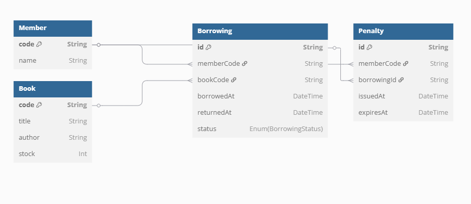

## ERD


## Entities

- Member
- Book

## Use Case

- Members can borrow books with conditions
    - [x] Members may not borrow more than 2 books
    - [x] Borrowed books are not borrowed by other members
    - [x] Member is currently not being penalized
- Member returns the book with conditions
    - [x] The returned book is a book that the member has borrowed
    - [x] If the book is returned after more than 7 days, the member will be subject to a penalty. Member with penalty cannot able to borrow the book for 3 days
- Check the book
    - [x] Shows all existing books and quantities
    - [x] Books that are being borrowed are not counted
- Member check
    - [x] Shows all existing members
    - [x] The number of books being borrowed by each member


## Mock Data

- Books

```tsx
[
    {
        code: "JK-45",
        title: "Harry Potter",
        author: "J.K Rowling",
        stock: 1
    },
    {
        code: "SHR-1",
        title: "A Study in Scarlet",
        author: "Arthur Conan Doyle",
        stock: 1
    },
    {
        code: "TW-11",
        title: "Twilight",
        author: "Stephenie Meyer",
        stock: 1
    },
    {
        code: "HOB-83",
        title: "The Hobbit, or There and Back Again",
        author: "J.R.R. Tolkien",
        stock: 1
    },
    {
        code: "NRN-7",
        title: "The Lion, the Witch and the Wardrobe",
        author: "C.S. Lewis",
        stock: 1
    },
]
```

- Members

```tsx
[
    {
        code: "M001",
        name: "Angga",
    },
    {
        code: "M002",
        name: "Ferry",
    },
    {
        code: "M003",
        name: "Putri",
    },
]
```
